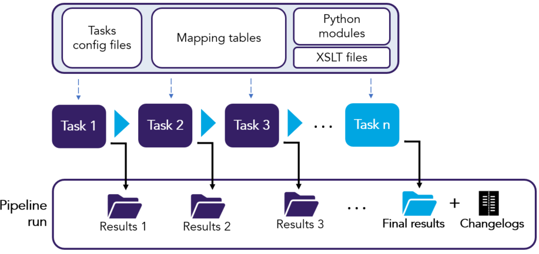

# Portail Epidemiologie France (PEF) to FReSH pipeline

## Overview  
The **PEF to FReSH Pipeline** is a Python project designed to reformat and transform metadata references from the [Portail Epidemiologie France (PEF) catalog](https://epidemiologie-france.aviesan.fr/) for integration into the FReSH (France Recherche en Santé Humaine) catalog.

This pipeline automates data cleaning and reformatting tasks, ensuring compatibility with the [FReSH metadata schema](https://github.com/portail-fresh/fresh-metadata-schema).

## Source Data

The Portail Epidémiologie France (PEF) catalog includes **1,099** bilingual records (French and English). Of these, **24** were excluded from the migration to the FReSH catalog: **20** belong to the medico-administrative domain and fall outside the scope of FReSH, while **2** are duplicates of other published studies in PEF.

PEF contributors were asked to update their metadata records by **May 26, 2025**. Updates submitted after this date were not considered in the migration process.


## Data Transformation Pipeline

The data is transformed through a step-by-step process, with intermediate outputs saved at each stage to ensure traceability.

Each transformation task is implemented as a Python function designed to address a specific issue in the original metadata.

### Transformation stages

The transformation workflow is organized into three main stages:

- **PEF>PEF**: Content transformation of specific PEF elements. These operations modify only the content of elements without altering the PEF metadata schema. Typical tasks in this step include content normalization and alignment with controlled vocabularies adopted by the FReSH catalog.

- **PEF>PEF+**: Content transformation involving changes to the PEF metadata schema. In this step, the content of certain PEF elements is redistributed across different elements, and custom elements may be added to prepare the metadata for schema mapping to the FReSH schema. A specific namespace `<xsl:namespace name="fresh">urn:fresh-enrichment:v1</xsl:namespace>`  is added in order to distinguish custom elements from original PEF elements.

- **PEF+>FReSH**: Schema mapping from the customized PEF+ metadata schema to the FReSH metadata schema.

 


### Tasks list

The current implementation of the pipeline executes the following tasks:

| Task No. | Step     | Task                                                                                                       | Python Function                          |
| -------- | -------- | ---------------------------------------------------------------------------------------------------------- | ---------------------------------------- |
| 1        | PEF>PEF  | Correct XML files by replacing or removing invalid special characters that prevent parsing with `lxml`     | `correct_special_characters.py`          |
| 3        | PEF>PEF  | Correct XML files by replacing or removing invalid special characters, that do not prevent correct parsing | `correct_special_characters_optional.py` |
| 4        | PEF>PEF  | Format collection dates tags in order to follow a standard format                                          | `process_collection_dates.py`            |
| 5        | PEF>PEF  | Update french regions' names                                                                               | `update_regions.py`                      |
| 6        | PEF>PEF+ | Add links to related documents or publications                                                             | `add_related_documents.py`               |
| 7        | PEF>PEF  | Update health determinants categories                                                                      | `align_health_determinants.py`           |
| 8        | PEF>PEF  | Update biobank content categories                                                                          | `align_biobank_content.py`               |
| 9        | PEF>PEF  | Align data types                                                                                           | `align_data_types.py`                    |
| 10       | PEF>PEF  | Align participants' sex controlled vocabulary                                                              | `align_sex.py`                           |
| 11       | PEF>PEF  | Add PID to sex controlled vocabulary terms                                                                 | `add_id_to_sex.py`                       |
| 12       | PEF>PEF  | Align participants' age controlled vocabulary                                                              | `align_age.py`                           |
| 13       | PEF>PEF  | Add PID to age controlled vocabulary terms                                                                 | `add_id_to_age.py`                       |
| 14       | PEF>PEF  | Align health specialties categories                                                                        | `align_health_specs.py`                  |
| 15       | PEF>PEF  | Update recruitment sources categories                                                                      | `update_recruitment_sources.py`          |
| 16       | PEF>PEF  | Update population categories, adding people with disabilities                                              | `update_population_types.py`             |
| 17       | PEF>PEF  | Update study categories for observational studies                                                          | `update_study_categories.py`             |
| 18       | PEF>PEF  | Add recruitment timing information                                                                         | `add_recruitment_timing.py`              |
| 19       | PEF>PEF  | Update study status categories                                                                             | `update_study_status.py`                 |
| 20       | PEF>PEF+ | Add `fresh-enrichment` namespace to track custom elements                                                  | `add_fresh_enrichment_namespace.py`      |
| 21       | PEF>PEF+ | Add FReSH unique identifier following format _"FRESH-PEFXXXXX"_                                            | `add_fresh_identifier.py`                |
| 22       | PEF>PEF+ | Separate inclusion and exclusion criteria                                                                  | `process_inclusion_criteria.py`          |
| 23       | PEF>PEF+ | Dispatch data access information from one to multiple custom fields                                        | `dispatch_data_access.py`                |
| 24       | PEF>PEF+ | Add PID to data access categories                                                                          | `add_id_to_dataaccess.py`                |
| 25       | PEF>PEF+ | Update PIs', team members' and contacts' information                                                       | `update_contacts.py`                     |
| 26       | PEF>PEF+ | Add CESSDA categories for collection mode                                                                  | `add_collection_mode_categories.py`      |
| 27       | PEF>PEF+ | Add "Rare diseases" flag for concerned studies                                                             | `add_rare_diseases.py`                   |
| 28       | PEF>PEF+ | Add NCT identifier for studies listed in ClinicalTrials.gov                                                | `add_nct_identifier.py`                  |
| 29       | PEF>PEF+ | Add research type label (always "observational study" for PEF records)                                     | `add_research_type.py`                   |
| 30       | PEF>PEF+ | Add provenance information about the metadata document ("PEF" by default)                                  | `add_provenance.py`                      |
| 31       | PEF>PEF+ | Add CIM-11 pathologies                                                                                     | `add_pathologies.py`                     |
| 32       | PEF>PEF+ | Add nations involved in the study, together with ISO-3166 codes                                            | `add_nations.py`                         |
| 33       | PEF>PEF+ | Update authorizing agencies list                                                                           | `add_authorizing_agency.py`              |
| 34       | PEF>PEF+ | Add the name of the person that created/edited the metadata sheet                                          | `add_metadata_contributors.py`           |
| 35       | PEF>PEF+ | Declare third party source for studies that used medico-administrative sources                             | `add_third_party_source.py`              |
| 36       | PEF>PEF+ | Update funding agencies information and status (public, private, ...)                                      | `update_fundings.py`                     |
| 37       | PEF>PEF+ | Update sponsor's information (name, type, ID)                                                              | `update_sponsor.py`                      |
| 38       | PEF>PEF+ | Add CESSDA sampling procedures                                                                             | `add_sampling_procedure.py`              |
| 39       | PEF>PEF+ | Add parent categories for nested controlled vocabularies categories                                        | `add_parent_category.py`                 |
| 40       | PEF>PEF+ | Convert ICD-11 codes to URIs                                                                               | `convert_icd_codes_to_uris.py.py`        |
| 41       | PEF>PEF+ | Clean final XML from duplicate values and empty elements                                                   | `remove_duplicate_empty.py`              |


More detailed description of each task is described in the `docs/` folder.

### Tasks definition

Tasks are defined respecting the following criteria:

 - Each task should solve a unitary issue with original metadata
 - Each modification on an input XML file should produce a copy of the modified XML file as output.

Tasks are implemented following as much as possible a common coding style and structure.

Task functions generally share three common default input arguments:

 - `xml_file`: the filename of the XML file to be processed
 - `input_folder`: the input folder where the XML file to be processed is stored
 - `output_folder`: the output folder where to store the copy of the XML file after the processing

Depending the task, they might miss one or more default input arguments and need some other extra and/or optional arguments.

Task function usually don't return, but just store the processed XML files in the designated output folder.

Tasks functions are stored in the `pipeline/tasks` folder and exported through the `pipeline/tasks/__init__.py` file:

```python
# __init__.py

from .get_xml_files import get_xml_files
from .correct_special_characters import correct_special_characters
from .correct_special_characters_optional import correct_special_characters_optional
...

# Define __all__ to specify the public API of the tasks module
__all__ = [
    "get_xml_files",
    "correct_special_characters",
    "correct_special_characters_optional",
    ...
]

```

 


### Pipeline execution

The pipeline execution is defined in the `main.py` file.

Tasks functions are imported from the `pipeline/tasks` folder and the execution order is defined in the `tasks` list of the `run_pipeline()` function in `main.py` file.

```python
# main.py

...
from pipeline.tasks import * 

...
def run_pipeline():
  ...
  tasks = [
        (correct_special_characters, {}),
        (correct_special_characters_optional, {}),
        (process_collection_dates, {}),
    ]
  ...

```

Tasks should be added in the `tasks` list as tuples containing the function names as first item, and a dictionnary containing extra arguments (for defaults ones, see section: [Tasks definition](#tasks-definition)).

## Setup and usage

1. **Clone this repository**  
   Clone the GitHub repository locally using `git`. Make sure you have Git installed on your system, then run:

    ```bash
    git clone git@github.com:portail-fresh/pef-to-fresh-pipeline.git
    ```

    After cloning, move into the project directory:

    ```bash
    cd pef-to-fresh-pipeline/
    ```

2. **Install Dependencies**  
   Ensure that all required packages are installed. To install the dependencies, create a python venv or a conda env and run:
     ```bash
    pip install -r requirements.txt
    ```
3. **Prepare Input Data**  
   - Copy the original PEF XML files in the `files/input-files` folder, or in the path defined in the folders' YAML file.
   - Copy the Excel conversion table files in the `files/conversion-tables` folder, or in the path defined in the folders' YAML file.
   - Copy the Excel controlled vocabularies in the `files/vocabularies` folder.


4. **Configure API information**  
   Rename the `configs/api.txt` file into `api.yaml` and configure the API parameters for the ICD API requests.

5. **Run the Pipeline**  
   To execute the main pipeline, run:
   ```bash
   python main.py
   ```


## References

- **Portail Epidemiologie France (PEF)**  
  The Portail Epidemiologie France catalog provides access to French health-related data sources for research and public health. More information can be found at:  
  [https://epidemiologie-france.aviesan.fr/](https://epidemiologie-france.aviesan.fr/)

- **lxml Library**  
  `lxml` is a Python library for XML and HTML parsing that supports XPath and XSLT. This project uses `lxml` to process XML files. Library documentation:  
  [https://lxml.de/](https://lxml.de/)

- **saxonche Library**  
  `saxonche` is a Python library that provides a Python interface to SaxonC, enabling XML and XSLT processing capabilities. It is based on the Saxon-HE processor. Library documentation:  
  [https://www.saxonica.com/saxon-c/index.xml](https://www.saxonica.com/saxon-c/index.xml)

- **pipreqs Library**  
  The `pipreqs` library was used to automatically generate a `requirements.txt` file with the dependencies of the project:  
  [https://github.com/bndr/pipreqs](https://github.com/bndr/pipreqs)

- **International Classification of Diseases (ICD) APIs**  
  ICD APIs v2 was used to retrieve diseases label names and URIs from ICD-11 codes.
  The documentation of the ICD APIs is available here: 
  [https://icd.who.int/docs/icd-api/APIDoc-Version2/](https://icd.who.int/docs/icd-api/APIDoc-Version2/). An OpenAPI Swagger interface of the APIs is available here: [https://id.who.int/swagger/index.html](https://id.who.int/swagger/index.html)

